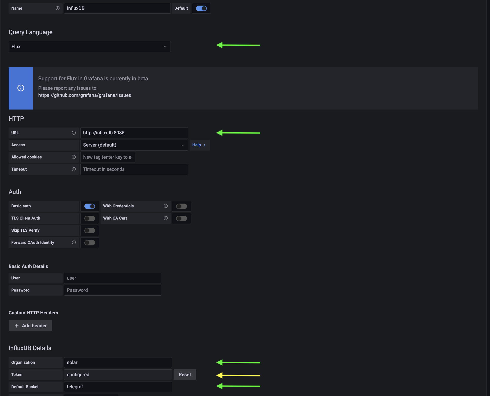

# Solax PV Monitoring System


Note that this is a work in progress.

This is a monitoring dashboard for Solax PV systems. Yes, there is the Solax mobile app and there is the Solaxcloud web UI but both leave things to be desired, for instance

* Going back in time arbitrarily to look at all the reported metrics
* Totals for all the interesting metrics
* Things like daily or monthly totals on energy spend or gain from feeding energy into the grid
* Getting a breakdown across different PV panel areas (if you have more than one)
* etc

# Thanks to

(https://github.com/huntabyte/tig-stack) which has been used as a base for the infrastructure.

# Infrastructure Used

Telegraf, InfluxDB, Grafana (aka TIG Stack) plus Mosquitto MQTT server and a Python client application utilizing the [Solax API](https://www.solaxcloud.com/green/user_api/SolaxCloud_User_Monitoring_API_V6.1.pdf) feeding PV system metrics via MQTT into the rest of the stack. A Grafana dashbaord is provided for monitoring.

Deployment is simplified via [Docker](https://docs.docker.com/engine/install/) and [Docker Compose](https://docs.docker.com/compose/install/).


# Installation

So far this monitoring system has been tested only under Linux and macOS. Your mileage may vary if you use another platform.

You should also have knowledge of how to navigate directories and how to modify files on the OS platform you use. Basic knowledge of Docker is advantageous.

You will need docker and docker-compose installed as a prerequsite. If not available already on the system where you want to run the monitoring services then get Docker from [here](https://www.docker.com/get-started/). It should be feasible to run this also with [podman](https://podman.io/) and [podman-compose](https://docs.podman.io/en/latest/markdown/podman-compose.1.html) but this has not been tested as of yet.

Now clone the project

```bash
git clone https://github.com/ffxf/solax-pv-monitor.git
```

Navigate to the project directory

```bash
cd solax-pv-monitor
```

Change the environment variables defined in `.env` that are used to setup and deploy the stack.

```bash
├── telegraf/
├── .env                <---
├── .client_env
├── .inverter_line_map
├── docker-compose.yml
├── entrypoint.sh
└── ...
```

Also change some settings highlighted in `.client_env` to configure the Solax API client connectivity. You will need to get a Solax API token from [Solaxcloud](https://www.solaxcloud.com/green/#/api) for your PV system for this. See the [Solax API documentation](https://www.solaxcloud.com/green/user_api/SolaxCloud_User_Monitoring_API_V6.1.pdf) for more information.
 
```bash
├── telegraf/
├── .env
├── .client_env         <---
├── .inverter_line_map
├── docker-compose.yml
├── entrypoint.sh
└── ...
```

In particular, change this line

```bash
TOKEN = <Solax API token. Get from Solaxcloud. Put in quotes, e.g. "123">
```

to something like

```bash
TOKEN = "24346564335464763436464646"
```

with the value of the token corresponding to what you have obtained from Solaxcloud.

Also change these lines

```bash
[inverter_sns]
sn1 = <Inverter serial number. Check network dongle on inverter. E.g. "SYLASDWFG">
sn2 = <2nd inverter if more than 1>
# More inverters
```
to point to your inverter serial numbers. You can find them on the network dongle plugged into the bottom of your inverter. The Solax API documentation explains what to look for. When done, this section of the file should look similar to this

```bash
[inverter_sns]
sn1 = "SYLASDWFG"
sn2 = "SYPSKFHSR"
```

Finally modify the lines in `.inverter_line_map` to point to your Solax inverters and how you want the PV panel lines be respresented (if you have more than one you might want to label the by location, e.g., "South", "West", "East", etc).

```bash
├── telegraf/
├── .env
├── .client_env
├── .inverter_line_map  <---
├── docker-compose.yml
├── entrypoint.sh
└── ...
```

E.g., your file could look like so when done:

```bash
SYLASDWFG:powerdc1:S
SYLASDWFG:powerdc2:W1
SYPSKFHSR:powerdc1:W2
SYPSKFHSR:powerdc2:E
```

Now start the services
```bash
docker-compose up -d
```

and point your browser to `<ip-of-your-server>:3210` and log into Grafana, initially using the default user name `amin` and password `admin`. Then first add FluentDB as a data source via the cog wheel icon on the left navigation bar. The FluentDB data source configuration should look like so:



In particular, be sure you set the fields with the green arrows to what you see in this screenshot. The token field with the yellow arrow needs to be set to what you have in the `.env` file for the parameter `DOCKER_INFLUXDB_INIT_ADMIN_TOKEN`. Click on `save & test` and you should see a green checkbox and a message saying that 3 buckets have been discovered.

Then hover over the `+` icon in the left navigation bar and select `Import`. Now load one of the dashboard JSON files in this directory (`dashboard.json` for German and `dashb_eng.json` for English language support). Be sure you select the fluentdb data source you have just configured at the bottom.

Once the dashboard is loaded, you should be able to see data from your PV system getting displayed.

# Docker Images Used (Official & Verified)

[**Telegraf**](https://hub.docker.com/_/telegraf) / `1.19`

[**InfluxDB**](https://hub.docker.com/_/influxdb) / `2.1.1`

[**Grafana-OSS**](https://hub.docker.com/r/grafana/grafana-oss) / `8.4.3`

[**Mosquitto**](https://hub.docker.com/_/eclipse-mosquitto) / `latest`

[**Python-Paho**](https://hub.docker.com/r/ff114084/python-paho) / `latest`


# Troubleshooting

If you cannot get the docker images pulled when starting the services then you may not have the necessary rights configured. Either change that or pull the containers manually using `sudo` before restarting the services. Before doing so stop the services using

```bash
docker-compose stop
```

If you do not see data getting populated in the dashbaord then it is best to inspect the output of the services. You can do so either via the command

```bash
docker-compose logs
```

or be first halting the services via


```bash
docker-compose stop
```
and then restart them with

```bash
docker-compose up
```

(i.e. **without** the `-d` we have used before). This will not daemonize the services and all output will show up in your terminal.

In either case, ook for error messages in the output and try to fix the problems being highlighted. Possible reasons can be, for example, that the configuration of the Solax API token is not correct or that the admin token for fluentd is not configured correctly.

Note that you will need another terminal session to modify things while the system is running if not daemonized.

To stop the system in this debug mode hit `Ctrl-C` in the terminal with the output and then restart it using the `-d` option again.

# Contributing and ToDo List

Contributions are always welcome!

Here is a list of some of the things to be done:

* Streamline and simplify the configuration and installation process, perhaps with an installation script
* Add more documentation, e.g. a better troubleshooting section
* Test on Windows (get it to work there)
* Test on a RaspberryPi (get it to work there)
* Reorganize the source code into some subdirectories
* Refine and optimize the dashboard (not much expertise with fluxlang and Grafana was available when creating this dashboard)
* Could also look into getting it to work on top of Kubernetes, e.g. using K3s

