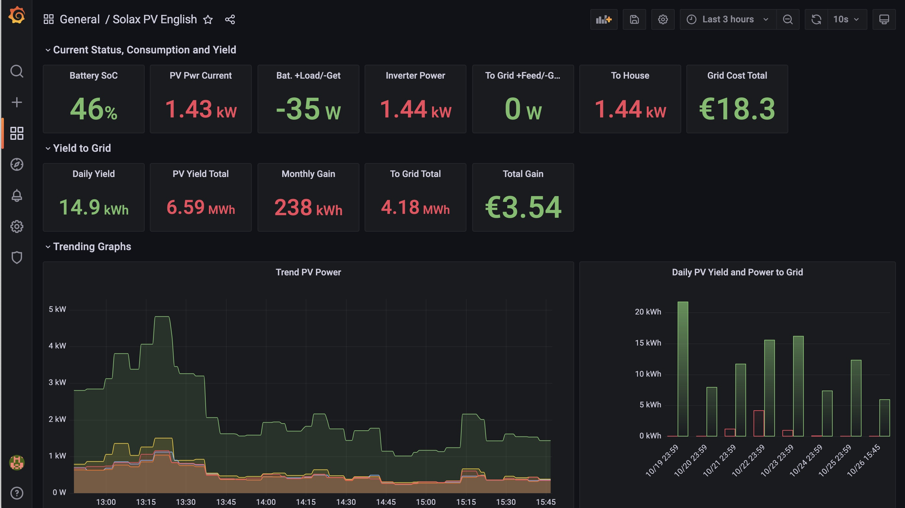

# Solax PV Monitoring System


Note that this is a work in progress.

This is a monitoring dashboard for Solax PV systems. Yes, there is the Solax mobile app and there is the Solaxcloud web UI but both leave things to be desired, for instance

* Going back in time arbitrarily to look at all the reported metrics
* Totals for all the interesting metrics
* Things like daily or monthly totals on energy spend or gain from feeding energy into the grid
* Getting a breakdown across different PV panel areas (if you have more than one)
* etc

# Thanks to

(https://github.com/huntabyte/tig-stack) which has been used as a base for the infrastructure.

# Infrastructure Used

Telegraf, InfluxDB, Grafana (aka TIG Stack) plus Mosquitto MQTT server and a Python client application utilizing the [Solax API](https://www.solaxcloud.com/green/user_api/SolaxCloud_User_Monitoring_API_V6.1.pdf) feeding PV system metrics via MQTT into the rest of the stack. A Grafana dashbaord is provided for monitoring.

Deployment is simplified via [Docker](https://docs.docker.com/engine/install/) and [Docker Compose](https://docs.docker.com/compose/install/).


## Getting Started

Clone the project

```bash
git clone https://github.com/ffxf/solax-pv-monitor.git
```

Navigate to the project directory

```bash
cd olax-pv-monitor
```

Change the environment variables defined in `.env` that are used to setup and deploy the stack.

```bash
├── telegraf/
├── .env                <---
├── .client_env
├── .inverter_line_map
├── docker-compose.yml
├── entrypoint.sh
└── ...
```

Also change some settings highlighted in `.client_env` to configure the Solax API client connectivity. You will need to get a Solax API token from [Solaxcloud](https://www.solaxcloud.com/green/#/api) for your PV system for this. See the [Solax API documentation](https://www.solaxcloud.com/green/user_api/SolaxCloud_User_Monitoring_API_V6.1.pdf) for more information.
 
```bash
├── telegraf/
├── .env
├── .client_env         <---
├── .inverter_line_map
├── docker-compose.yml
├── entrypoint.sh
└── ...
```
Finally modify the lines in `.inverter_line_map` to point to your Solax inverters and how you want the PV panel lines be respresented.

```bash
├── telegraf/
├── .env
├── .client_env
├── .inverter_line_map  <---
├── docker-compose.yml
├── entrypoint.sh
└── ...
```

Start the services
```bash
docker-compose up -d
```

and point your browser to `<ip-of-your-server>:3210` and log into Grafana, initially using the default user name `amin` and password `admin`. Then hover over the `+` icon in the left navigation bar and select `Import`. Now load one of the dashboard JSON files in this directory (`dashboard.json` for German and `dashb_eng.json` for English language support). Be sure you select the default fluentdb data source while doing so.

You should now be able to see data from your PV system getting displayed in the dashboard.

## Docker Images Used (Official & Verified)

[**Telegraf**](https://hub.docker.com/_/telegraf) / `1.19`

[**InfluxDB**](https://hub.docker.com/_/influxdb) / `2.1.1`

[**Grafana-OSS**](https://hub.docker.com/r/grafana/grafana-oss) / `8.4.3`

[**Mosquitto**](https://hub.docker.com/_/eclipse-mosquitto) / `latest`

[**Python-Paho**](https://hub.docker.com/r/ff114084/python-paho) / `latest`


## Contributing

Contributions are always welcome!

